# Safety, Facilities and Logistics Phase 1 System Architecture and Implementation Guide — v2 (Reviewed Baseline)

## Document Control

| Field | Value |
|---|---|
| Document | SFL Phase 1 System Architecture and Implementation Guide |
| Domain | Safety, Facilities and Logistics |
| Architecture Style | DDD-first modular monolith using Clean Architecture, SOLID principles, event-driven integration and Dockerized deployment |
| Technology Baseline | C# / .NET Core, Keycloak, PostgreSQL, Redis, Kafka, Docker, web portal, mobile field workflows, device integration hub |
| Target Audience | Solution architects, developers, QA, infrastructure engineers, cybersecurity, operational owners, vendors, and implementation partners |
| Status | Reviewed implementation baseline |
| Revision | v2 — incorporates the pre-implementation architecture review (see Part 0 Change Log) |

## Part 0. Version 2 Revisions (Authoritative)

> **Status of this part.** Part 0 is the reviewed v2 delta. It carries the original v1 guide forward unchanged below it, and **adds** the decisions that a pre-implementation review found missing. **Where Part 0 conflicts with any later section, Part 0 governs.** Sections use letter suffixes (0A, 0B, …) so the original section numbering (1–25) is preserved. Full code stubs for the two highlighted concerns (pluggable auth, microservice extraction) live in the companion `SFL_Phase1_Architecture_Review_and_Recommendations.md`; the essential interfaces are reproduced here.

### 0.0 Change Log (v1 → v2)

| # | Change | Driver |
|---|---|---|
| 1 | Added quantified non-functional requirements and targets (0A). | NFRs existed in the source Cluster 9 doc but were dropped; you cannot size or commission without them. |
| 2 | Added an explicit Edge + Core deployment topology and Operating Modes (0B). | NFR-02: examination centres must keep operating during WAN failure. The v1 single central stack does not satisfy this. |
| 3 | Made all infrastructure (identity, messaging, cache, persistence) pluggable via Ports & Adapters, with a concrete swappable-auth design (0C). | Explicit goal: replace Keycloak or plug another auth provider without touching application code. |
| 4 | Added the rules and enforcement that actually make modules extractable into services (0D). | Explicit goal: extract microservices later without breakage. v1 asserted this but nothing prevented the coupling that blocks it. |
| 5 | Added life-safety and emergency invariants (0E). | Liability/latency: SFL must stay outside the certified life-safety actuation path; emergency alerts must not be gated by routine approval. |
| 6 | Added inbound-integration security (0F) and tamper-evident audit (0G). | Internet-facing webhooks need authentication; NFR-04 requires tamper-evidence, which "append-only in Postgres" does not provide. |
| 7 | Added observability/tracing (0H), data protection & retention (0I), config-without-code (0J), idempotency (0K) and site-scoping enforcement (0L). | Operability, Ghana DPA / biometric handling, NFR-09 configurability, at-least-once delivery, and tenant isolation. |
| 8 | Updated Release 0 build order to deliver the ports, edge skeleton and security controls first (0M). | These are skeleton-shaping; retrofitting them later is rework. |

### 0A. Non-Functional Requirements and Targets

These are carried forward from the Cluster 9 source and quantified. Values marked **(TBC)** are placeholders the team must confirm against real estate/scale; they exist so the architecture can be sized and tested rather than asserted. Every NFR has a verification.

| Ref | NFR | Target (confirm where TBC) | Verification |
|---|---|---|---|
| NFR-01 | Availability | 99.5% standard; elevated resilience during examination windows | Uptime SLO + commissioning availability test |
| NFR-02 | Edge survivability | Centre operations continue through WAN loss; reconcile on restore (RPO at edge ≤ 0 for captured evidence via local outbox) | CT-17 edge-failover test (0M) |
| NFR-03 | Security | Encrypted transport everywhere; MFA for privileged users; RBAC on every command/query; SIEM monitoring | Security test suite + pen test |
| NFR-04 | Audit integrity | Append-only **and tamper-evident** (hash-chained) audit | CT-18 audit-tamper test (0G/0M) |
| NFR-06 | Evidence retention & chain-of-custody | Provenance, timestamp, hash, actor preserved; retention per data class (0I) | Evidence governance tests |
| NFR-09 | Configurability without code | SLA thresholds, escalation rules, zones, severities, fuel limits, readiness checklists, retention all configurable at runtime | Config-change test with no redeploy |
| NFR-12 | Data sovereignty | Mission-critical biometric/CCTV/access/incident/audit data on institution-controlled infrastructure unless the Board approves a compliant model | Hosting review sign-off |
| NFR-S1 | Capacity **(TBC)** | Peak concurrent portal users; device count × heartbeat rate; access events/sec at peak; monthly evidence growth | Load test against confirmed numbers |
| NFR-S2 | Latency **(TBC)** | Life-safety/emergency path end-to-end target (e.g. ≤ 2 s detection→notification fast lane); dashboard freshness tolerance | Latency test on the fast lane (0E) |
| NFR-S3 | Recovery **(TBC)** | Core RTO/RPO and Edge RTO/RPO targets | DR rehearsal (G5) |

### 0B. Edge and Core Deployment Topology, and Operating Modes

The platform deploys in **two tiers**, not one central stack.

- **Core tier (HQ + DR):** source of truth, central Postgres, Kafka, identity, reporting, cross-centre dashboards, integration to the wider CLET ecosystem.
- **Edge tier (per examination centre):** a slim runtime that keeps the centre operating during WAN loss. Runs on the local examination/NBES servers already in scope.

Classify every capability as one of:

| Class | Behaviour during WAN loss | Examples |
|---|---|---|
| Core-only | Unavailable at edge; not needed live at a centre | Executive dashboards, cross-centre reporting, enterprise integrations |
| Edge-cached read | Read from a cached snapshot; no writes lost because none occur | Reference data, permission snapshot, candidate/visitor lookups |
| Edge-authoritative-then-reconcile | Writes accepted locally to a **local outbox**, reconciled to Core on restore | Hall readiness checks, access-event capture, incident capture, evidence capture, visitor check-in |

The **outbox pattern already chosen (v1 §6.5) extends to the edge** as a store-and-forward queue. Identity at the edge must validate tokens **offline** (cached JWKS) against a **bounded-staleness permission snapshot** — see 0C and 0L. IDs are generated at the edge (GUID/ULID, never a shared sequence) so offline writes never collide.

**Operating Modes.** Model platform mode as first-class state (the source distinguishes *Routine* from *Examination Mode*: VLAN isolation, hall-readiness lock, heightened controls, NECC command). Mode changes which SLAs, authorizations and locks apply — e.g. in Examination Mode a confirmed-ready hall is locked against booking/config changes. Mode is an explicit, audited transition, not implicit behaviour.

### 0C. Ports & Adapters — pluggable infrastructure (including auth)

**Principle (applies to identity, messaging, cache, persistence):** application and domain code depend on an **interface**; the concrete product lives in exactly one Infrastructure adapter. The product's name must not appear anywhere except inside its adapter. This is what makes Keycloak/Kafka/Redis/Postgres swappable and is the same discipline that enables extraction (0D) and the edge (0B).

**Pluggable identity — split runtime (standards) from admin (product-specific):**

- *Runtime token validation & claims* are pure OIDC/OAuth2/JWT/JWKS → portable across any compliant provider (Keycloak, Entra ID, Auth0, Okta, Zitadel, Authentik).
- *Admin / provisioning / joiner-mover-leaver* differs per product (Keycloak Admin REST ≠ Microsoft Graph ≠ Auth0 Management API) → isolated behind one narrow port.

Canonical model and ports (full adapters in the review doc, Deep Dive A):

```csharp
// SharedKernel/Contracts — no provider claim names ever leak past the adapter
public sealed record SflPrincipal(
    string SubjectId, string DisplayName, string? Email,
    IReadOnlyCollection<string> Roles, IReadOnlyCollection<string> Groups,
    IReadOnlyCollection<string> SiteScopes, bool MfaSatisfied,
    IReadOnlyDictionary<string,string> RawClaims);

// Application ports (product-agnostic):
public interface IAccessTokenValidator {            // standards-based; works offline at edge via cached JWKS
    Task<TokenValidationResult> ValidateAsync(string token, CancellationToken ct); }
public interface IPrincipalFactory {                // normalizes ANY provider's claims -> SflPrincipal
    SflPrincipal Create(IReadOnlyDictionary<string,string[]> claims); }
public interface IIdentityAdminPort {               // the ONLY product-specific surface (provisioning/JML)
    Task<string> CreateUserAsync(NewUser u, CancellationToken ct);
    Task DisableUserAsync(string subjectId, CancellationToken ct);
    Task AssignRoleAsync(string subjectId, string role, CancellationToken ct); }
public interface IServiceTokenProvider {            // machine-to-machine (client credentials)
    Task<string> GetServiceTokenAsync(string audience, CancellationToken ct); }
```

```csharp
// Provider chosen by configuration; swapping = config + register the other adapter set.
public static IServiceCollection AddSflIdentity(this IServiceCollection s, IdentityOptions o) {
    s.AddSingleton<IAccessTokenValidator, OidcAccessTokenValidator>();   // provider-agnostic
    if (o.Provider == "Keycloak") {
        s.AddSingleton<IPrincipalFactory, KeycloakPrincipalFactory>();
        s.AddScoped<IIdentityAdminPort, KeycloakIdentityAdminAdapter>();
    } else if (o.Provider == "EntraId") {
        s.AddSingleton<IPrincipalFactory, EntraIdPrincipalFactory>();
        s.AddScoped<IIdentityAdminPort, EntraIdAdminAdapter>();
    }
    return s;   // no controller/handler/domain/workflow code changes on swap
}
```

Rules (architecture-test enforced, 0D/§18): persist only the IdP `sub` as the identity key; authorize on canonical `SflPrincipal` roles/sites; the strings `Keycloak`/`realm_access`/`Graph`/`Auth0` may appear **only** under `Infrastructure/Identity/<Provider>/`. Keycloak roles are never a substitute for SFL workflow authorization (v1 §14.2 stands). **Honest scope:** token validation/SSO/JWT are free to swap; admin APIs, group/role models, MFA policy and SSO federation need per-product adapter work — contained, not a rewrite.

Apply the same pattern to the rest of infrastructure: `IIntegrationEventBus` (Kafka adapter; a lighter broker or Postgres-queue adapter is allowed for Phase 1 and at the edge), `ICacheStore` (Redis adapter), and repository interfaces (EF/Postgres adapter).

### 0D. Microservice Extraction — the rules that make it safe

v1 asserts "extractable bounded contexts" but nothing prevents the coupling that blocks extraction. The following are **mandatory** and enforced by architecture tests.

**Five rules:**
1. **Talk to a module only through its public contract.** Each module ships a `*.Contracts` project (facade interface + DTOs + published events). Other modules reference **only** `*.Contracts`, never another module's `Domain`/`Application`/`Infrastructure`.
2. **Schema per module, never crossed.** **No cross-schema foreign keys, joins or views.** Reference other contexts by ID; resolve via their contract or their published events.
3. **No cross-module database transaction.** Each module commits its own state + outbox; cross-module consistency is eventual (events/sagas), with explicit compensation.
4. **Own your IDs.** GUID/ULID minted in-process (also required for the edge).
5. **Abstract the transport.** Calls and events go through interfaces (`IModuleClient<T>`, `IIntegrationEventBus`) so wiring switches from in-proc to HTTP/gRPC without touching callers.

**Solution-structure delta (supersedes v1 §5 layout):** add a `*.Contracts` project per module.

```text
src/
  SFL.IFIMP.Contracts/   SFL.IFIMP/  (Domain/Application/Infrastructure — referenced by nobody outside IFIMP)
  SFL.SSEMP.Contracts/   SFL.SSEMP/
  SFL.FTLMP.Contracts/   SFL.FTLMP/
  SFL.AVAMP.Contracts/   SFL.AVAMP/
  SFL.SharedKernel/      (keep MINIMAL & stable; becomes a versioned package on extraction)
```

**Facade pattern (extraction = swap one DI line + split schema; callers unchanged):**

```csharp
public interface IFacilitiesModule {                       // in SFL.IFIMP.Contracts
    Task<RoomReadinessDto?> GetRoomReadinessAsync(RoomId id, CancellationToken ct); }
// today:  InProcFacilitiesModule  -> calls IFIMP's own application layer
// later:  HttpFacilitiesModule    -> same interface, calls the extracted IFIMP service
```

**Cross-module flows are sagas/process managers** that compute from each module's events into their own read model — never a cross-schema join (reference: Hall Readiness saga in the review doc).

**Enforcement (NetArchTest/ArchUnitNET in `SFL.ArchitectureTests`):** modules depend only on other modules' `*.Contracts`; Domain has no EF/Kafka/Redis/provider dependency; plus a DB lint that **fails the build if any FK references another schema**.

**Extraction-readiness checklist** (all true before extracting a module): called only via its contract + events; zero cross-schema FKs/joins; own IDs; all cross-module interactions idempotent and latency-tolerant; events registered with backward compatibility; own outbox + independently-hostable consumers; tracing in place; data-migration plan to split its schema. **Honest caveat:** extraction still requires splitting the database, adding timeout/retry/circuit-breaker to facade calls, and versioning SharedKernel — it becomes a *planned migration, not a rewrite*. The natural first candidate is Life-Safety (see 0E and the SSEMP split in 0D-note).

**0D-note — SSEMP is too coarse.** Keep SSEMP as a platform but split into sub-contexts with their own contracts/aggregates/seams: *Physical Security* (visitor, access, CCTV, intrusion), *Life-Safety* (fire/panic/smoke), *HSE* (incidents/CAPA), *Emergency Communications* (mass notification). Life-safety's higher criticality and certification sensitivity must not be coupled to visitor badges.

### 0E. Life-Safety and Emergency Invariants

- **SFL never sits in the certified life-safety actuation path.** The fire/intrusion vendor systems sound alarms and trigger evacuation hardware independently and remain authoritative and certified (e.g. EN 54 / UL / local fire code). SFL **observes, governs, records and supplements** (mass notification, dashboards, evidence). State this in §7 and the integration matrix.
- **Fast lane for safety/emergency events** bypasses non-essential enrichment; meets the NFR-S2 latency target.
- **Break-glass mass notification:** pre-authorized templates + roles may fire during a declared emergency **without** per-message approval; approval is recorded after the fact. Approval-before-send applies only to routine notices and must never gate life-safety.
- **Degraded mode:** the emergency-notification path must have a fallback (edge-triggered or provider-direct) if Core is unavailable during an emergency (consistent with 0B).
- **Backpressure:** device-state events are debounced/coalesced at the IntegrationHub so a flapping panel cannot flood the SOC queue or Kafka.

### 0F. Inbound Integration Security (webhooks, callbacks, device events)

Every inbound endpoint (`/api/integrations/webhooks/{vendor}`, vendor callbacks, device feeds) must, before a payload reaches any domain command: verify a **per-vendor HMAC signature** or **mTLS client certificate**; **allowlist source IPs**; **validate against the registered schema**; then store-raw → classify → publish. Reject-and-log on failure. Machine-to-machine calls use client-credentials service accounts (`svc-sfl-*`) with mTLS where the network allows. Idempotency keys prevent duplicates; they are **not** an authentication control.

### 0G. Tamper-Evident Audit (supersedes "append-only" wording in v1 §4.2/§16.2)

"Append-only in Postgres" is a convention, not tamper-evidence. Implement: each audit record stores `hash = H(prev_hash || canonical(record))` (**hash-chain**); the audit-writer DB role has **insert-only** permission (no UPDATE/DELETE); periodically **anchor** the chain head to an append-only/WORM store or sign it. Apply the same chaining to evidence access/export logs (files are already hashed in v1). Tampering with any record breaks the chain and is detectable by replay (NFR-04).

### 0H. Observability

Standardize on **OpenTelemetry** (traces + metrics + logs). Propagate trace context through the Kafka envelope (add `traceparent` to the standard envelope in §6.4) so a correlation ID can be followed across HTTP → outbox → Kafka → consumers. Treat **consumer lag** and **dead-letter rate** as first-class SLOs surfaced on the Integration Health Dashboard. Health probes distinguish **liveness / readiness / startup**.

### 0I. Data Protection and Retention

Biometric templates, facial-recognition data, CCTV, visitor and candidate records are special-category personal data under Ghana's Data Protection Act, 2012 (Act 843) and equivalents. Add a data-protection layer: **classify** each data category; document the **lawful basis/consent** for biometric processing; set **retention per category** (CCTV retention is often legally bounded — purge on schedule); apply **data minimization** (publish references/metadata in events, never sensitive content — v1 already says this); support **data-subject requests**. Reconcile the hosting model with **NFR-12 data sovereignty** before selecting any managed cloud datastore.

### 0J. Configuration Without Code (NFR-09)

SLA thresholds, escalation rules, access zones, alert severities, fuel limits, readiness checklists and retention policies must be **runtime-configurable, versioned and audited** — changed by operational owners through governed configuration, never a redeploy. Keep this out of module logic behind a configuration/rules capability.

### 0K. Delivery Semantics and Idempotency

Outbox + Kafka is **at-least-once**, not exactly-once: duplicates will occur. Every consumer must be **idempotent**, backed by a **durable dedup table (Postgres)** keyed on `event_id` (Redis may front it for speed but is never the only record). Every cross-module side effect must be safe to repeat.

### 0L. Site-Scoping and Tenancy Enforcement

Model: single-organization, multi-site (centres). "Apply location scoping" is enforced centrally, not by developer memory: a query specification/filter applied in the repository layer driven by the principal's `SiteScopes`, **and** PostgreSQL Row-Level Security as defense-in-depth. "Every query is site-scoped" is an architecture-test-able convention. At the edge, scoping uses the cached permission snapshot (0B/0C).

### 0M. Build-Order Changes (updates v1 §9 Release 0 and §18 tests)

Release 0 additionally delivers, **before** any operational module: the infrastructure **ports** (identity, event bus, cache, repositories) with their default adapters; the **edge skeleton** (local outbox + offline token validation) proven with one capability; **inbound-integration security** (HMAC/mTLS/allowlist/schema validation); **tamper-evident audit** (hash-chain); **OpenTelemetry** tracing; and the **architecture tests** that enforce 0C/0D (contracts-only references, no cross-schema FKs, no product names inward).

Add commissioning tests: **CT-17 Edge Failover** (sever WAN; centre continues capturing readiness/access/incident/evidence to local outbox; reconciles cleanly on restore), **CT-18 Audit Tamper-Evidence** (alter a stored audit row; chain replay detects it), **CT-19 Forged Webhook Rejection** (unsigned/wrong-IP payload is rejected and logged, never reaches a command), **CT-20 Emergency Fast-Lane Latency** (detection→notification within the NFR-S2 target via break-glass), **CT-21 Provider Swap** (re-point identity to a second OIDC provider via config; login + authorization still pass).

---

## 1. Purpose

This document defines the implementation architecture for the Phase 1 Safety, Facilities and Logistics systems. It is written as a practical guide that a delivery team can follow to design, build, test, commission, and operate the system.

Phase 1 must deliver 13 fast-track systems across facilities, safety/security, fleet/logistics, and emergency operations. These systems must not be built as 13 disconnected applications. They should be delivered as coordinated platform modules using one shared enterprise layer for identity, workflow, audit, evidence, notifications, integrations, and dashboards.

The SFL platform must also communicate with external systems in the wider CLET enterprise landscape. It should expose versioned APIs, publish/consume Kafka events where appropriate, and integrate through controlled adapters instead of direct database coupling. SFL should be a good citizen in the wider enterprise architecture: it owns safety, facilities and logistics workflows, but it exchanges data with identity, HR, finance, examinations, student records, procurement, document management, analytics, SIEM/NOC/SOC and communication platforms.

The goal is to create one operational control platform that can answer five critical questions:

1. Are the buildings, halls, rooms, utilities, and operational spaces ready?
2. Are people, visitors, restricted zones, CCTV, access control, fire/life-safety, and incidents governed?
3. Are vehicles, fuel, dispatches, courier items, and examination logistics traceable?
4. Are evidence, approvals, exceptions, and audit records preserved?
5. Can management see readiness, risks, incidents, and exceptions in real time?

## 2. Architecture Decision: DDD or EDD

Use both, but not for the same job.

The recommended approach is:

> Use Domain-Driven Design as the system design method, and use Event-Driven Design as the integration and workflow communication pattern.

DDD should define the business boundaries, entities, commands, workflows, rules, and ownership. Event-driven design should move operational facts between modules, devices, dashboards, audit logs, notification services, and external integrations.

### 2.1 Recommended Architecture

| Layer | Recommendation | Reason |
|---|---|---|
| Business modeling | DDD | The domain has clear operational boundaries: facilities, safety/security, logistics, assets, workflow, audit, identity, and integrations. |
| Application shape | Modular monolith for Phase 1 | Faster to build, easier to govern, simpler deployment, lower distributed-system risk. |
| Integration style | Event-driven | Device alerts, CCTV health, access events, dispatch updates, fuel exceptions, and emergency notifications are naturally event-based. |
| Internal design | Clean Architecture + SOLID | Keeps domain rules independent from frameworks, databases, UI, devices and vendor SDKs. |
| Future scalability | Extractable bounded contexts | Modules can later become services if scale, team structure, or procurement requires it. |
| Identity provider | Pluggable OIDC provider (Keycloak as default adapter) | Standards-based OIDC/OAuth2 so the provider is swappable behind ports — see Part 0C. |
| Database | PostgreSQL with schemas per context | Gives one reliable enterprise data platform while preserving ownership boundaries. |
| Cache | Redis | Provides fast operational reads, dashboard snapshots, role/permission caching, device-health snapshots, and short-lived idempotency locks. |
| Messaging | Kafka | Provides durable event streaming, device/event ingestion, async processing, retries, notification fan-out, and reporting updates. |
| Deployment | Dockerized containers | Keeps development, staging and production consistent; supports Docker Compose locally and container orchestration in production. |

### 2.2 Why Not Microservices First

Microservices should not be the Phase 1 default. The first priority is operational correctness, audit integrity, workflow consistency, and fast delivery. Starting with microservices creates extra work around distributed transactions, deployment pipelines, service discovery, observability, versioning, and team coordination.

Build the Phase 1 platform as a modular monolith with clean internal boundaries. Use an outbox pattern and event contracts from day one. This gives the implementation team most of the future flexibility without the early operational burden.

## 3. Phase 1 Scope

Phase 1 contains 13 fast-track systems.

| ID | System | Platform | Phase 1 Role |
|---|---|---|---|
| S152 | Computer-Aided Facility Management / IWMS | SFL.IFIMP | Facilities master data, buildings, rooms, zones, readiness, and service control |
| S153 | Computerized Maintenance Management System | SFL.IFIMP | Work orders, preventive maintenance, faults, vendors, SLAs, and evidence closure |
| S159 | Room and Resource Booking System | SFL.IFIMP | Room booking, resource allocation, conflict checks, setup tasks, readiness support |
| S160 | Visitor Management System | SFL.SSEMP | Pre-registration, host approval, badges, check-in/out, visitor roll-call |
| S160a | Physical Access Control Integration | SFL.SSEMP | Door access, card/biometric events, access rules, overrides, joiner-mover-leaver support |
| S161 | CCTV / Video Management Integration | SFL.SSEMP | Camera health, incident linkage, evidence request, footage export governance |
| S162 | Intrusion Detection and Alarm Monitoring | SFL.SSEMP | Intrusion alerts, restricted-zone alarms, SOC queue, escalation |
| S162a | Fire-Safety and Life-Safety Monitoring | SFL.SSEMP | Fire alarms, smoke/panic events, safety inspections, emergency response triggers |
| S163 | Health and Safety Incident / Near-Miss Reporting | SFL.SSEMP | Incident reporting, HSE cases, corrective actions, safety dashboards |
| S166 | Fleet and Vehicle Management | SFL.FTLMP | Fleet register, vehicle compliance, service status, assignment readiness |
| S168_fuel | Fuel Management and Driver Logbooks | SFL.FTLMP | Fuel transactions, logbooks, reconciliation, exception review |
| S171 | Mailroom / Courier and Dispatch Tracking | SFL.FTLMP | Courier items, sealed dispatches, receipt confirmation, chain-of-custody |
| S174 | Emergency Mass Notification | SFL.SSEMP | SMS/email/push/voice/siren/signage activation, approvals, acknowledgements |

### 3.1 Phase 1 Supporting Capability

Although full asset visibility is a Phase 2 concern, Phase 1 should include an asset reference capability called SFL.AVAMP-Lite.

SFL.AVAMP-Lite should support:

- Asset/device identifiers for CCTV cameras, access readers, fire panels, vehicles, rooms, and logistics items.
- Simple custody/location references.
- Device-to-location mapping.
- Evidence references.
- Future migration into full RFID/barcode inventory.

Do not wait until full asset management to establish identifiers. The rest of the platform needs stable asset and device references from day one.

## 4. Platform Architecture

The SFL system should be designed as four domain platforms supported by shared enterprise services.

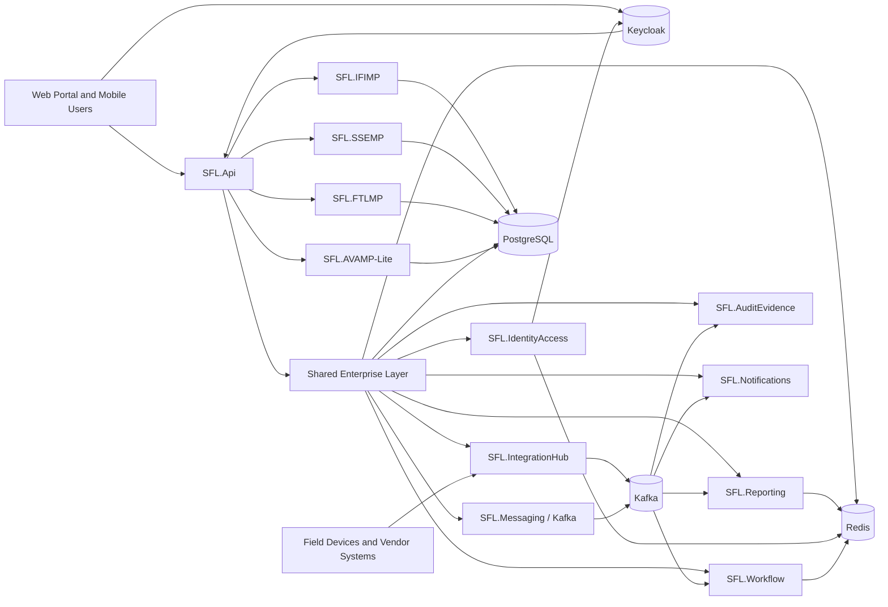

### 4.1 Four Platform Domains

| Platform | Purpose | Phase 1 Focus |
|---|---|---|
| SFL.IFIMP | Integrated Facilities and Infrastructure Management Platform | Facilities register, CMMS, room/resource booking, readiness scoring |
| SFL.SSEMP | Safety, Security and Emergency Management Platform | Visitor management, access control, CCTV, alarms, fire/life-safety, HSE, emergency notifications |
| SFL.FTLMP | Fleet, Transport and Logistics Management Platform | Fleet register, fuel, driver logbooks, courier/dispatch tracking |
| SFL.AVAMP-Lite | Asset Visibility Reference Layer | Asset/device identifiers, location mapping, evidence references |

### 4.2 Shared Enterprise Layer

| Shared Service | Technical Name | Purpose |
|---|---|---|
| Identity and Access | SFL.IdentityAccess + Keycloak | Authentication, SSO, OIDC/OAuth2 token validation, role resolution, MFA enforcement, system user accounts |
| RBAC and Approvals | Keycloak + SFL.IdentityAccess + SFL.Workflow | Keycloak manages authentication, groups and role claims; SFL manages contextual permissions, delegated authority, approval chains and workflow authorization |
| Workflow Engine | SFL.Workflow | Tasks, approvals, escalations, SLAs, evidence-required closure |
| Audit and Evidence | SFL.AuditEvidence | Tamper-evident (hash-chained) audit events, evidence metadata, attachment references, hashes — see Part 0G |
| Notifications | SFL.Notifications | Email, SMS, push, voice, siren, signage, acknowledgement tracking |
| Integration Hub | SFL.IntegrationHub | APIs, adapters, webhooks, queues, retry handling, vendor gateway |
| Reporting | SFL.Reporting | Operational dashboards, readiness scores, trend reports, executive views |
| Distributed Cache | SFL.Caching | Redis-backed caching for permissions, dashboard snapshots, lookup data, readiness summaries, device latest-state views |
| Messaging and Event Streaming | SFL.Messaging | Kafka producers, consumers, topic contracts, outbox publishing, retry and dead-letter handling |

### 4.3 Redis and Kafka Placement

Redis and Kafka should be treated as first-class infrastructure components, but they should not replace PostgreSQL.

| Component | Role | Use For | Do Not Use For |
|---|---|---|---|
| PostgreSQL | Source of truth | Operational records, workflows, evidence metadata, audit events, configuration, reporting read models | High-frequency transient polling state |
| Redis | Fast distributed cache | Role/permission cache, lookup cache, dashboard summaries, device latest-state snapshots, readiness snapshots, idempotency keys, short-lived locks | Permanent audit, evidence, financial records, video files, durable workflow state |
| Kafka | Durable event stream and message processing backbone | Device events, domain events, workflow triggers, notification fan-out, integration retries, reporting updates, async processing | Primary transactional storage, synchronous command validation, evidence file storage |

The design rule is:

> PostgreSQL records what is true, Kafka moves what happened, Redis accelerates what is frequently read.

### 4.4 Keycloak Identity and RBAC Placement

> **v2 note (Part 0C governs):** Keycloak is the *default* identity adapter, not a hard dependency. Application/API code depends on `IAccessTokenValidator`, `IPrincipalFactory` and `IIdentityAdminPort`; the provider is selected by configuration and any compliant OIDC provider (Entra ID, Auth0, Zitadel, Authentik) can replace it by swapping the adapter set. Read "Keycloak" below as "the identity adapter."

Keycloak should be the identity provider for the SFL platform.

Keycloak should own:

- User authentication.
- Single sign-on.
- MFA policies.
- OAuth2/OIDC token issuing.
- Realm/client configuration.
- Groups.
- Coarse-grained platform roles.
- Service accounts for system-to-system access.
- Password policy and account lifecycle controls.

SFL.IdentityAccess should own:

- Mapping Keycloak users, groups, and roles into application permissions.
- Site/location scoping.
- Operational role assignments.
- Permission snapshots used by the application.
- User profile references required by workflows.
- Synchronization records and audit of authorization changes.

SFL.Workflow should own:

- Delegated approvals.
- Temporary authority.
- Access override approval.
- Evidence export approval.
- Escalation rights.
- Workflow-specific authorization.
- Approval expiry and restoration rules.

The design rule is:

> Keycloak decides who the user is and their broad role claims. SFL decides what that user can do inside a specific operational workflow, site, room, device, case, or evidence request.

Recommended Keycloak setup:

| Keycloak Item | Recommendation |
|---|---|
| Realm | `sfl` |
| Clients | `sfl-web-portal`, `sfl-mobile-api`, `sfl-api`, `sfl-worker-service` |
| Protocol | OpenID Connect |
| Token type | JWT access tokens with role and group claims |
| MFA | Required for privileged users and optional/conditional for standard users |
| Service accounts | Dedicated accounts for workers, integration adapters, and admin automation |
| Groups | Use for business groupings such as facilities, security, logistics, audit, admin |
| Roles | Use for coarse application roles such as `SFL_ADMIN`, `SSEMP_SOC_OPERATOR`, `IFIMP_MAINTENANCE_SUPERVISOR` |

Redis may cache Keycloak-derived permission snapshots for short periods, but authorization must remain correct if the cache is cleared.

Kafka may receive identity-related events such as `UserRoleChanged`, `UserDisabled`, or `PermissionMappingChanged` so reporting, workflow assignment, and Redis cache invalidation stay aligned.

### 4.5 CLET-Wide External Systems Integration

SFL must be designed as one domain platform inside the wider CLET enterprise architecture. It should communicate with external systems through clear contracts, adapters and event streams. It must not depend on direct database access to other systems.

| External System / Domain | Direction | Integration Pattern | SFL Use |
|---|---|---|---|
| Keycloak / Enterprise Identity | Inbound | OIDC/OAuth2, JWT, groups, roles, service accounts | Authentication, SSO, MFA, service access, role claims |
| HRMS / Staff Records | Inbound | API or Kafka event, fallback controlled file import | Staff joiner-mover-leaver events, reporting lines, staff status, access provisioning basis |
| Examination Systems | Bidirectional | Versioned API and Kafka events | Exam schedules, hall assignments, readiness status, incident exceptions, dispatch readiness |
| Student Information / Candidate Records | Inbound / controlled query | API with strict authorization | Candidate identity context, approved accommodations, visitor/exception handling |
| Finance / ERP | Bidirectional | API, Kafka events, approved reconciliation files | Fuel reconciliation, asset financial references, vendor payments, budget/payment evidence |
| Procurement / Contract Management | Inbound / outbound | API or document/evidence reference | Vendor contracts, procurement milestones, warranties, variation evidence |
| Document / Records Management | Outbound / reference lookup | API, object reference, signed document metadata | Evidence archives, SOPs, certificates, inspection records, handover documents |
| SIEM / SOC / NOC | Outbound / inbound | Syslog/API/Kafka bridge where approved | Security logs, device alerts, incident escalation, technical health visibility |
| Communication Providers | Outbound / callback inbound | SMS/email/voice/push/siren/signage APIs | Emergency alerts, assignments, visitor notices, delivery receipts |
| Analytics / BI | Outbound | Reporting database views, Kafka stream, governed API | Executive dashboards, trend analysis, operational performance |
| External Vendor Platforms | Bidirectional | Adapter through SFL.IntegrationHub | CCTV, access control, fire, intrusion, fuel, GPS, RFID and future device integrations |

External integration rules:

- Use versioned APIs or versioned Kafka event contracts.
- Put all external integrations behind `SFL.IntegrationHub` adapters.
- Do not share databases across systems.
- Preserve raw inbound payloads for audit and troubleshooting.
- Use idempotency keys for external messages and callbacks.
- Use correlation IDs across API calls, Kafka events and workflow records.
- Validate data ownership before accepting updates from an external system.
- Apply anti-corruption mapping so external data models do not leak into SFL domain entities.
- Use retries and dead-letter topics for asynchronous integration failures.
- Expose only the minimum required data to external systems.

The integration boundary should follow this pattern:

```text
External System -> SFL.IntegrationHub Adapter -> Validation -> Domain Command/Event -> Workflow/Audit/Dashboard
SFL Domain Event -> Outbox -> Kafka/API Adapter -> External System
```

## 5. Recommended .NET Solution Structure

Use the following naming convention. Do not use organization-specific names in namespaces, assemblies, database schemas, queues, or service names.

```text
SFL.sln
  src/
    SFL.Api/
    SFL.WebPortal/
    SFL.MobileApi/
    SFL.WorkerService/

    SFL.SharedKernel/
    SFL.IdentityAccess/
    SFL.Workflow/
    SFL.AuditEvidence/
    SFL.Notifications/
    SFL.IntegrationHub/
    SFL.Reporting/
    SFL.Caching/
    SFL.Messaging/

    SFL.IFIMP/
    SFL.SSEMP/
    SFL.FTLMP/
    SFL.AVAMP/

    SFL.Infrastructure/

  tests/
    SFL.UnitTests/
    SFL.IntegrationTests/
    SFL.ApiTests/
    SFL.SolutionTests/
    SFL.ArchitectureTests/
    SFL.EndToEndTests/
```

### 5.1 Clean Architecture Structure

Each domain module should follow Clean Architecture. Business rules must not depend on controllers, Entity Framework, PostgreSQL, Redis, Kafka, Keycloak, vendor SDKs, HTTP clients or UI frameworks.

Dependency direction:

```text
Web/API/Workers -> Application -> Domain
Infrastructure -> Application abstractions
Domain -> no outward dependency
```

The domain layer owns enterprise rules. The application layer owns use cases. The infrastructure layer implements persistence, messaging, caching, identity and external adapters.

### 5.2 Module Internal Structure

Each domain module should follow a consistent structure.

```text
SFL.SSEMP/
  Domain/
    Entities/
    ValueObjects/
    Events/
    Rules/
    Services/

  Application/
    Commands/
    Queries/
    Workflows/
    DTOs/
    Validators/
    EventHandlers/

  Infrastructure/
    Persistence/
    Integrations/
    Repositories/
    Migrations/

  Contracts/
    Events/
    Requests/
    Responses/
```

### 5.3 Layer Responsibilities

| Layer | Responsibility | May Depend On | Must Not Depend On |
|---|---|---|---|
| Domain | Entities, aggregates, value objects, domain events, domain services, business rules | SharedKernel only | EF Core, ASP.NET, Redis, Kafka, Keycloak, vendor SDKs |
| Application | Commands, queries, handlers, validators, workflow orchestration, ports/interfaces | Domain, SharedKernel | Concrete databases, concrete message brokers, concrete vendor clients |
| Infrastructure | EF Core, PostgreSQL, Redis, Kafka, Keycloak client integration, external APIs, repositories | Application abstractions, Domain | UI concerns |
| API / Portal | Controllers, endpoints, auth middleware, request/response mapping | Application contracts | Direct domain mutation, direct database access |
| WorkerService | Outbox publishing, Kafka consumers, scheduled tasks, background processors | Application services, Infrastructure | UI concerns |
| Tests | Unit, integration, API, solution, architecture and end-to-end verification | Target layers | Production secrets or uncontrolled external dependencies |

### 5.4 SOLID Implementation Principles

Use SOLID principles as implementation rules, not slogans.

| Principle | SFL Rule |
|---|---|
| Single Responsibility | A command handler should execute one use case. A repository should persist one aggregate type. A vendor adapter should integrate one vendor/system concern. |
| Open/Closed | Add a new device/vendor adapter through an interface implementation, not by editing existing workflow code. |
| Liskov Substitution | Adapter implementations must honor the same contracts so simulated, test and production adapters can be swapped safely. |
| Interface Segregation | Keep interfaces small: separate camera health, footage export, access events, notification sending and fuel import contracts. |
| Dependency Inversion | Application and domain code depend on abstractions; infrastructure provides PostgreSQL, Redis, Kafka, Keycloak and vendor implementations. |

### 5.5 Dependency Rule

Domain modules should not depend directly on each other.

Allowed:

- SFL.SSEMP publishes `SecurityIncidentRaised`.
- SFL.Workflow receives it and creates tasks.
- SFL.Notifications sends alerts.
- SFL.Reporting updates read models.

Avoid:

- SFL.SSEMP directly calling SFL.FTLMP database tables.
- SFL.IFIMP directly updating SFL.SSEMP internal entities.
- Device vendors writing directly into operational tables.

## 6. Data, Cache, and Messaging Design

### 6.1 PostgreSQL Operational Store

Use one PostgreSQL database for Phase 1, separated by schemas. PostgreSQL is the authoritative source of truth for operational records, workflow state, audit records, evidence metadata, and configuration.

| Schema | Owner | Purpose |
|---|---|---|
| identity | SFL.IdentityAccess + Keycloak references | Local user references, Keycloak subject IDs, role mappings, permission snapshots, site scopes, delegated authority records |
| workflow | SFL.Workflow | Workflow instances, tasks, approvals, SLAs, escalation states |
| audit | SFL.AuditEvidence | Audit events, evidence references, hashes, immutable event records |
| integration | SFL.IntegrationHub | Integration messages, vendor events, failed payloads, retries |
| ifimp | SFL.IFIMP | Facilities, rooms, work orders, preventive maintenance, room bookings |
| ssemp | SFL.SSEMP | Visitors, access events, CCTV events, incidents, alarms, HSE, emergency notifications |
| ftlmp | SFL.FTLMP | Vehicles, drivers, fuel records, dispatches, courier items, logs |
| avamp | SFL.AVAMP-Lite | Asset/device references, tags, locations, custody references |
| reporting | SFL.Reporting | Read models, dashboard snapshots, KPIs, readiness scores |

### 6.2 Core Entity Groups

| Entity Group | Examples |
|---|---|
| Location model | Site, building, floor, room, hall, access zone, parking area, warehouse |
| Device model | Camera, NVR, access reader, biometric reader, fire panel, intrusion sensor, GPS tracker |
| Workflow model | Workflow instance, task, approval, escalation, SLA, closure evidence |
| Evidence model | Evidence request, evidence item, file reference, hash, approval, access log |
| Facilities model | Work order, fault, preventive schedule, vendor task, room booking |
| Security model | Visitor, badge, access event, incident, alarm event, CCTV event, evacuation roll-call |
| Logistics model | Vehicle, driver, fuel transaction, logbook, dispatch manifest, courier movement |
| Reporting model | Readiness score, dashboard card, exception queue, compliance trend |

### 6.3 Redis Cache Design

Redis should be used for fast operational reads and short-lived coordination state. Redis is not the source of truth.

Recommended Redis use cases:

| Use Case | Example Data | Suggested TTL / Rule |
|---|---|---|
| Role and permission cache | User permissions, role claims, location scope | 5-15 minutes, invalidate on role change |
| Reference data cache | Sites, buildings, rooms, zones, device lookup | 15-60 minutes, invalidate on master-data update |
| Dashboard snapshot cache | Executive summary, SOC counts, open SLA counts | 15-60 seconds for active dashboards |
| Device latest-state cache | Camera online/offline, access reader status, fire panel state | 15-120 seconds depending on device criticality |
| Readiness score cache | Hall readiness score, blocked items, last check time | 15-60 seconds during active readiness windows |
| Workflow inbox counts | Task counts by user, role, site, severity | 15-60 seconds |
| Idempotency keys | Webhook event IDs, API command idempotency keys | 1-24 hours depending on source |
| Short-lived distributed locks | Prevent duplicate processing of same external message | Seconds to minutes; never use as permanent lock |

Recommended key format:

```text
sfl:{module}:{purpose}:{scope}:{id}
```

Examples:

```text
sfl:ssemp:device-state:camera:CAM-001
sfl:ifimp:readiness:hall:HALL-A-04
sfl:identity:permissions:user:USR-1007
sfl:workflow:inbox-count:role:SOC_OPERATOR:site:HQ
sfl:integration:idempotency:vms:event:9f6a...
```

Redis invalidation should be event-driven. When Kafka publishes events such as `WorkOrderClosed`, `CameraOfflineDetected`, `RolePermissionChanged`, or `DispatchReceiptConfirmed`, the relevant consumers should update or invalidate Redis keys.

Do not store the following in Redis:

- Permanent audit trails.
- Evidence files.
- CCTV footage.
- Final workflow state.
- Financial or compliance records.
- Any record that must survive cache loss without reconstruction.

### 6.4 Kafka Messaging Design

Kafka should be the durable event-streaming and asynchronous processing backbone for the SFL platform.

Kafka should be used for:

- Device events from CCTV, access control, intrusion, fire/life-safety, fuel, GPS, and future RFID.
- Domain events from IFIMP, SSEMP, FTLMP, AVAMP, Workflow, and Identity.
- Workflow triggers and background processing.
- Notification fan-out.
- Dashboard/read-model updates.
- Integration retry and dead-letter processing.
- Audit event streaming to SIEM or downstream analytics where approved.

Kafka should not be used as:

- The transactional database.
- The evidence store.
- The CCTV video store.
- The place where synchronous permission checks are performed.

Recommended topic naming:

```text
sfl.{domain}.{event-name}.v{version}
```

Examples:

```text
sfl.ifimp.work-order-created.v1
sfl.ifimp.readiness-blocked.v1
sfl.ssemp.camera-offline-detected.v1
sfl.ssemp.access-denied-recorded.v1
sfl.ssemp.evidence-export-approved.v1
sfl.ftlmp.fuel-anomaly-detected.v1
sfl.ftlmp.dispatch-receipt-confirmed.v1
sfl.workflow.task-assigned.v1
sfl.integration.dead-letter.v1
```

Recommended consumer groups:

| Consumer Group | Purpose |
|---|---|
| `sfl.workflow` | Creates or advances workflow tasks from events |
| `sfl.reporting` | Updates dashboard and reporting read models |
| `sfl.notifications` | Sends alerts, assignments, emergency messages, and reminders |
| `sfl.audit` | Persists audit projections and forwards approved logs |
| `sfl.cache` | Updates or invalidates Redis keys |
| `sfl.soc` | Projects security-relevant events into SOC queues |
| `sfl.integration-retry` | Processes retryable integration failures |
| `sfl.dead-letter-monitor` | Monitors failed messages requiring support action |

Recommended partition keys:

| Event Type | Partition Key |
|---|---|
| Facility/work-order events | `site_id` or `facility_id` |
| Security incident events | `incident_id` |
| CCTV/access device events | `device_id` |
| Dispatch events | `dispatch_id` |
| Fuel events | `vehicle_id` |
| User/role events | `user_id` |

Every Kafka message should include:

- `event_id`
- `event_type`
- `event_version`
- `occurred_at`
- `correlation_id`
- `causation_id`
- `source_system`
- `tenant_or_site_scope`
- `actor_id` where applicable
- `traceparent` (W3C trace context — see Part 0H)
- `payload`

Failed Kafka processing should route to a dead-letter topic with the original payload, error reason, retry count, consumer group, and timestamp.

### 6.5 Outbox, Kafka, and PostgreSQL Rule

When a user command changes business state, write the aggregate change and the outbox event to PostgreSQL in the same transaction. A background outbox publisher then publishes the event to Kafka.

This prevents the common failure where the database changes but the event is never published.

### 6.6 Data Storage Rule For CCTV and Large Files

Do not store continuous video footage directly inside PostgreSQL.

PostgreSQL should store:

- Camera identifier.
- NVR/VMS identifier.
- Location and zone.
- Event timestamp.
- Evidence request metadata.
- Export approval status.
- File/object reference.
- Cryptographic hash.
- Viewer/export audit logs.

The actual video should remain in:

- The approved VMS/NVR storage.
- A secure NAS or object storage repository for approved exports.
- A controlled evidence archive where retention and access are governed.

## 7. Hardware and Vendor Integration Architecture

Phase 1 includes systems that will require purchased hardware or external platforms. The portal should not replace those specialist systems. It should govern, retrieve, monitor, and audit their operational data.

### 7.1 Device Integration Hub

All device and vendor integrations should enter through SFL.IntegrationHub. The integration hub should validate the source, store the raw message, publish a normalized event to Kafka, and update Redis only for safe latest-state or dashboard cache scenarios.

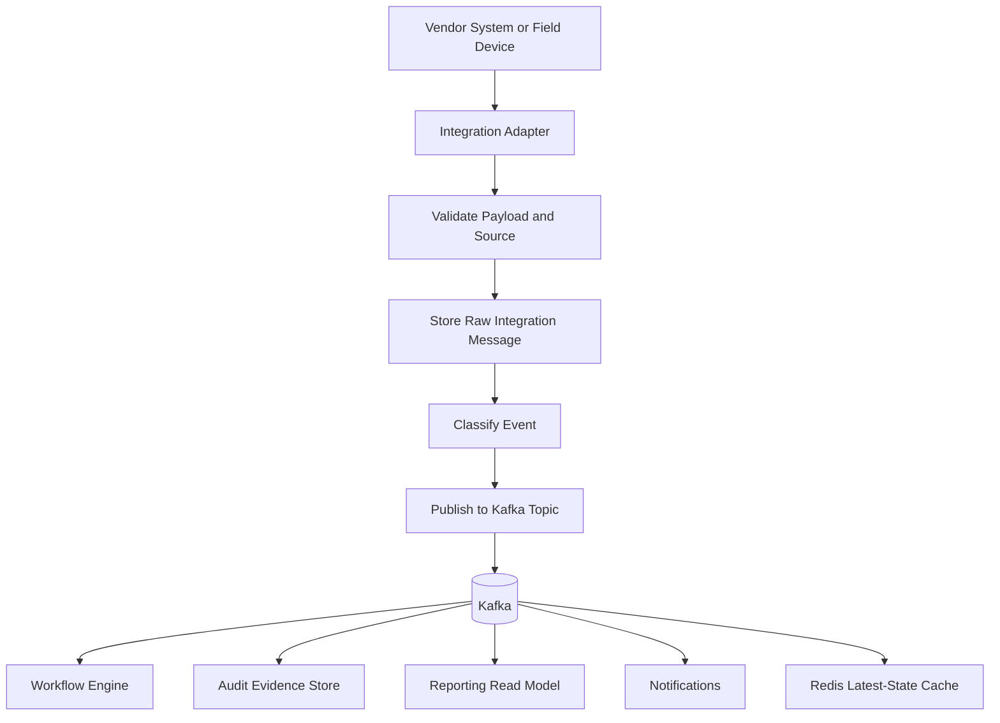

### 7.2 Procurement Integration Requirements

Every hardware or vendor package should include:

- API documentation.
- Webhook/event support where available.
- Test credentials and sandbox environment.
- Device health endpoint or monitoring feed.
- Export and evidence retrieval method.
- Integration support during commissioning.
- Data dictionary for events.
- Retention and backup documentation.
- Support SLA and escalation contacts.
- Security documentation.

### 7.3 Hardware Integration Matrix

| Hardware / Vendor System | Platform | Integration Pattern | Portal Data Retrieved |
|---|---|---|---|
| CCTV / VMS / NVR | SFL.SSEMP | VMS API, webhook, controlled export, camera health polling, Kafka event publication | Camera health, camera location, recording status, alert events, evidence export references |
| Access control / biometric readers | SFL.SSEMP | Access-control API, event stream, IAM synchronization, Kafka event publication | Access granted/denied, forced door, override events, reader health |
| Intrusion alarm panels | SFL.SSEMP | Alarm panel API, webhook, relay gateway, monitoring feed, Kafka event publication | Zone alarm, tamper event, restoration event, acknowledgement |
| Fire/life-safety panels | SFL.SSEMP | Fire panel gateway, BMS bridge, monitoring feed, Kafka event publication | Smoke alarm, fire alarm, panic button, panel fault, inspection status |
| SMS/email/voice/siren/signage | SFL.Notifications | Provider API, delivery receipt callbacks, Kafka notification status events | Message sent, failed, acknowledged, channel status |
| Vehicle fuel/fleet systems | SFL.FTLMP | Fuel provider import/API, driver mobile capture, Kafka event publication | Fuel issue, receipt, odometer, variance, driver logbook |
| GPS/telematics | Phase 2-ready in SFL.FTLMP | API/event feed, Kafka stream | Vehicle location, geofence, speed, route deviation |
| RFID/barcode scanners | Phase 2-ready in SFL.AVAMP | Mobile sync, offline queue, Kafka event publication | Asset scan, receipt, stocktake variance, custody transfer |

## 8. Dockerized Deployment Architecture

SFL should be Docker-tuned from the beginning. The same containerized components should run across development, staging and production, with environment-specific configuration supplied through environment variables, secrets and deployment manifests.

### 8.1 Container Components

| Container / Service | Purpose |
|---|---|
| `sfl-api` | Main .NET API for portal, mobile and external API access |
| `sfl-web-portal` | Web portal frontend |
| `sfl-worker-service` | Outbox publisher, Kafka consumers, scheduled jobs, background processing |
| `keycloak` | Identity provider, SSO, MFA, OIDC/OAuth2, role/group claims |
| `postgres` | Operational database and reporting read models |
| `redis` | Distributed cache, latest-state snapshots, idempotency keys, short-lived locks |
| `kafka` | Durable event stream and message processing backbone |
| `kafka-ui` or equivalent | Optional non-production Kafka topic/consumer visibility |
| `reverse-proxy` | TLS termination, routing and security headers where applicable |

### 8.2 Docker Rules

- Every deployable .NET component must have a Dockerfile.
- Use multi-stage Docker builds for .NET images.
- Run containers as non-root where possible.
- Keep configuration outside images.
- Use environment variables for non-secret config.
- Use Docker secrets, platform secrets or vault integration for secrets.
- Do not bake passwords, API keys, certificates or connection strings into images.
- Expose health endpoints for API, worker, database, Redis, Kafka and Keycloak dependencies.
- Use one image promoted across environments; do not rebuild separately for staging and production with different code.
- Keep local development close to production using Docker Compose.

### 8.3 Recommended Docker Files

```text
deploy/
  docker/
    api.Dockerfile
    worker.Dockerfile
    web.Dockerfile

  compose/
    docker-compose.dev.yml
    docker-compose.test.yml
    docker-compose.observability.yml

  env/
    .env.example

  migrations/
    README.md
```

### 8.4 Local Development Compose Stack

Local development should support a full runnable stack:

```text
sfl-api
sfl-web-portal
sfl-worker-service
keycloak
postgres
redis
kafka
```

The local stack should seed:

- Keycloak realm, clients, roles and test users.
- PostgreSQL schemas and seed data.
- Kafka topics.
- Redis baseline configuration.
- Sample sites, rooms, devices and workflows.

### 8.5 Production Deployment Guidance

Production can run on any approved container orchestration platform, but the deployment package should remain Docker-native.

Production deployment should include:

- Separate containers for API, worker and web frontend.
- Managed or clustered PostgreSQL where possible.
- Redis with persistence/replication policy appropriate for cache use.
- Kafka with configured retention, partitioning, monitoring and dead-letter topics.
- Keycloak with database-backed persistence and backup.
- TLS for external and internal service communication where required.
- Centralized logs and metrics.
- Container image scanning.
- Rollback strategy.
- Database migration strategy.
- Backup and restore tests.

### 8.6 Deployment Environments

| Environment | Purpose | Notes |
|---|---|---|
| Local | Developer build and debugging | Docker Compose with seeded services |
| Test | Automated API, integration and solution tests | Disposable or resettable containers |
| Staging | UAT, vendor integration rehearsals, training | Production-like configuration |
| Production | Live operation | Hardened configuration, monitoring, backup and support |

## 9. Phase-Based Implementation Plan

The implementation should be delivered in controlled releases. Each release must produce usable software, test evidence, and operational sign-off.

### Release 0: Foundation

Goal: Create the shared enterprise foundation.

| Deliverable | Description | Exit Criteria |
|---|---|---|
| Solution skeleton | .NET solution, modules, dependency rules, CI/CD baseline | Solution builds and deploys to dev/test |
| Clean Architecture baseline | Domain, application, infrastructure, API and worker boundaries with dependency checks | Architecture tests prevent invalid dependencies |
| Docker baseline | Dockerfiles, Docker Compose dev/test stacks, environment template and health checks | Full local stack starts with one compose command |
| PostgreSQL baseline | Schemas, migrations, seed data, environment config | Database deploys repeatably |
| Redis baseline | Redis connection, cache abstraction, key naming, TTL rules, invalidation handlers | Cache can be read, written, expired, and invalidated by event |
| Kafka baseline | Kafka brokers, topics, consumer groups, producer/consumer libraries, dead-letter topic | Messages publish, consume, retry, and dead-letter correctly |
| Keycloak identity and RBAC | Realm, clients, roles, groups, MFA policy, token validation, local permission mapping | User can sign in through Keycloak, token validates, and SFL permissions resolve |
| External integration catalogue | Enterprise systems list, owners, data contracts, API/event direction, fallback rules | Each external dependency has an owner and versioned contract |
| Workflow engine | Workflow instance, task, approval, SLA, escalation | A sample workflow can run end-to-end |
| Audit/evidence store | Append-only audit events, evidence references, hash fields | Every command creates audit trail |
| Kafka event bus and outbox | Internal domain events, integration events, retry handling, outbox publisher | Events persist in PostgreSQL and publish to Kafka reliably |
| Integration hub skeleton | Adapter pattern, raw message storage, retry/error queue | Sample external event creates workflow |
| Dashboard shell | Navigation, role dashboards, read model base | Users see dashboard based on role |
| Test project baseline | Unit, integration, API, solution, architecture and end-to-end test projects | CI can run the test suite by category |

### Release 1: Facilities Core - SFL.IFIMP

Goal: Deliver the basic facilities operating layer.

| System | Deliverables | Exit Criteria |
|---|---|---|
| S152 CAFM/IWMS | Site/building/room register, zones, readiness attributes, facility dashboard | Facilities master data can be maintained |
| S153 CMMS | Work request, work order, assignment, SLA, evidence capture, closure validation | Fault-to-work-order workflow passes UAT |
| S159 Room Booking | Room booking, conflict checks, resource requests, setup tasks | Booking creates required operational tasks |

### Release 2: Safety and Security Core - SFL.SSEMP

Goal: Deliver security, visitor, incident, CCTV, access, alarm, fire/life-safety, and emergency alert foundations.

| System | Deliverables | Exit Criteria |
|---|---|---|
| S160 Visitor Management | Pre-registration, host approval, badge issue, check-in/out, visitor register | Visitor can be registered and tracked |
| S160a Access Control Integration | Access event ingestion, door/reader mapping, override workflow | Access grant/deny/forced-door events appear in SOC queue |
| S161 CCTV/VMS Integration | Camera register, health status, incident linkage, evidence request workflow | CCTV evidence request requires approval and creates audit trail |
| S162 Intrusion Monitoring | Intrusion event queue, acknowledgement, escalation | Alarm event creates incident or closes as false alarm with reason |
| S162a Fire/Life-Safety Monitoring | Fire/panic/smoke event queue, emergency escalation | Fire/life-safety alert triggers workflow and notification option |
| S163 HSE Incident Reporting | Incident form, severity, CAPA, evidence, investigation notes | HSE case closes only with required evidence |
| S174 Emergency Notification | Zone selection, channel selection, approval, send, delivery/ack tracking | Emergency message can be sent and audited |

### Release 3: Fleet and Logistics Core - SFL.FTLMP

Goal: Deliver fleet, fuel, driver logbook, courier, and dispatch traceability.

| System | Deliverables | Exit Criteria |
|---|---|---|
| S166 Fleet Management | Vehicle register, compliance dates, service history, assignment state | Fleet dashboard shows vehicle readiness |
| S168_fuel Fuel and Driver Logbooks | Fuel records, odometer, driver logs, variance rules | Fuel anomaly workflow routes to manager |
| S171 Mailroom/Courier/Dispatch | Courier item register, dispatch manifest, receipt confirmation, exception handling | Dispatch movement preserves chain-of-custody |

### Release 4: Examination and Operational Readiness

Goal: Make the Phase 1 platform command-ready.

| Deliverable | Description | Exit Criteria |
|---|---|---|
| Hall readiness workflow | Facility, network, CCTV, access, fire/life-safety, power, logistics checklist | Hall cannot be marked ready with unresolved critical failures |
| SOC dashboard | CCTV health, access denials, incidents, alarms, visitors, emergency alerts | SOC operator can triage all security queues |
| Facilities readiness dashboard | Faults, work orders, room readiness, SLA breaches | Facilities team can see readiness risk |
| Logistics dashboard | Vehicles, fuel exceptions, dispatch state, receipts | Logistics team can track open movements |
| Executive dashboard | Overall readiness, critical incidents, SLA breaches, dispatch exceptions | Management can see current operational posture |

### Release 5: Commissioning and Go-Live

Goal: Validate the system before live operation.

| Gate | Required Evidence | Owner |
|---|---|---|
| G1 Infrastructure Ready | Network, device, CCTV, access-control, fire/alarm, server, backup tests | Infrastructure team |
| G2 Core Workflows Ready | User-tested workflows with evidence capture | Operational owners and delivery team |
| G3 Security Ready | RBAC, MFA, SIEM/logging, CCTV evidence governance, access logs | Security and cybersecurity team |
| G4 Operational Simulation | Hall readiness, incident, dispatch, emergency notification rehearsal | Operations, SOC, facilities, logistics |
| G5 DR and Recovery Ready | Backup/restore, retry queues, degraded operation procedures | Infrastructure and application team |
| G6 Management Sign-off | Dashboards reviewed, open risks accepted or resolved | Executive and operational owners |

## 10. Standard Workflow Pattern

Every operational module should follow the same workflow pattern.

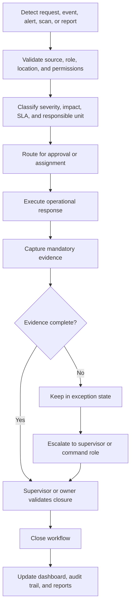

### 10.1 Universal Workflow Rules

- A critical workflow cannot close without required evidence.
- Every workflow action must create an audit event.
- Every escalation must preserve actor, timestamp, reason, and target role.
- Exceptions must remain visible until resolved, approved, or formally accepted.
- Manual overrides must require reason, approver, expiry time, and restoration evidence.
- Vendor/device events must never bypass validation and audit.

## 11. Phase 1 Key Workflows

### 11.1 Facility Fault to Work Order

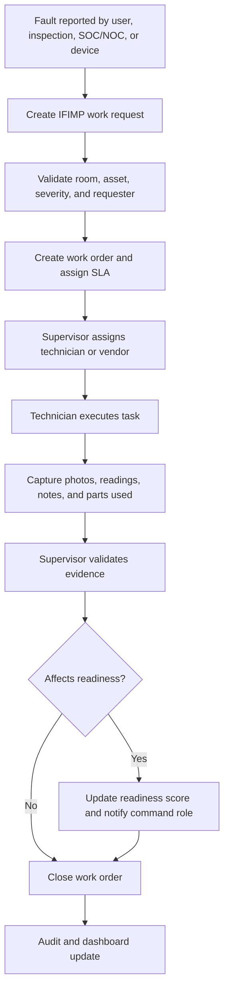

### 11.2 Room and Resource Booking

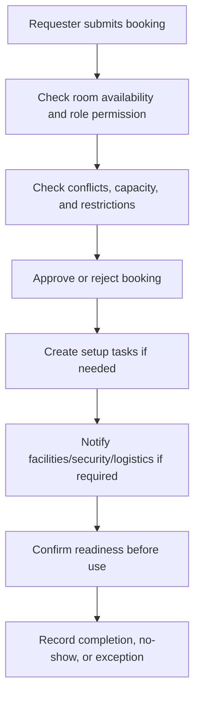

### 11.3 Visitor Management

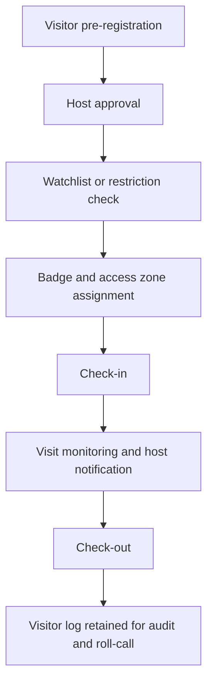

### 11.4 Access Control Override

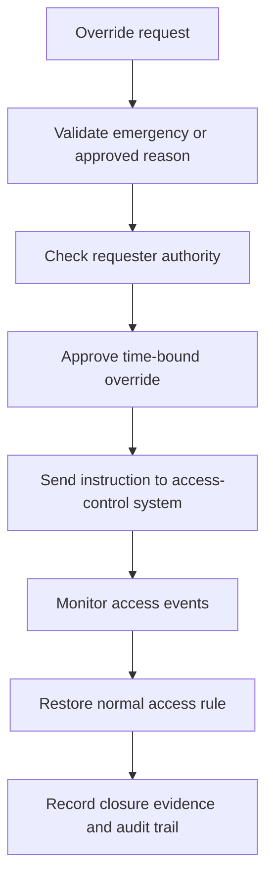

### 11.5 CCTV Evidence Request

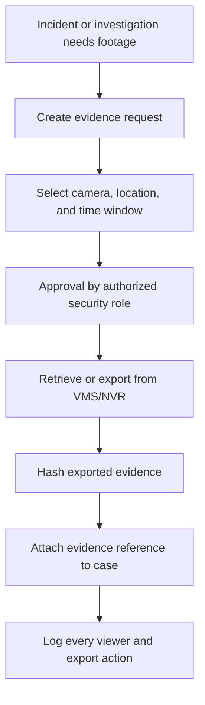

### 11.6 Safety / Security Incident Escalation

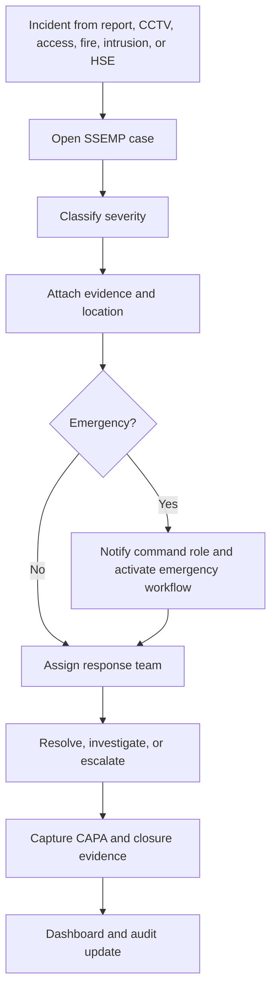

### 11.7 Emergency Mass Notification

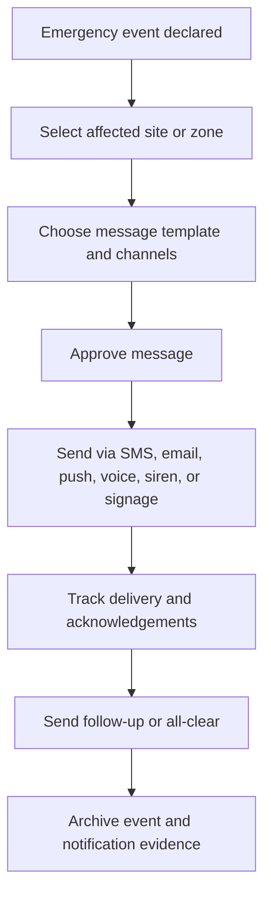

### 11.8 Fuel Anomaly Review

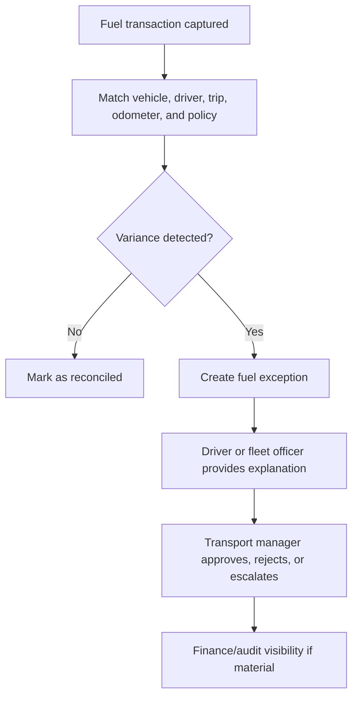

### 11.9 Courier / Dispatch Tracking

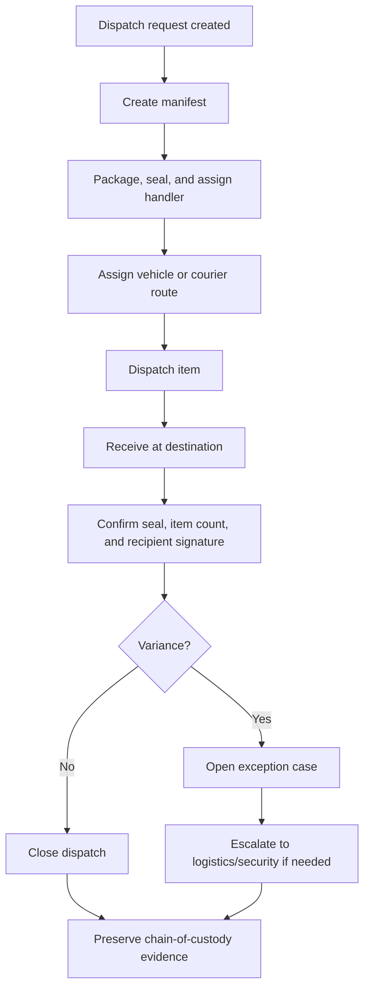

### 11.10 Hall Readiness

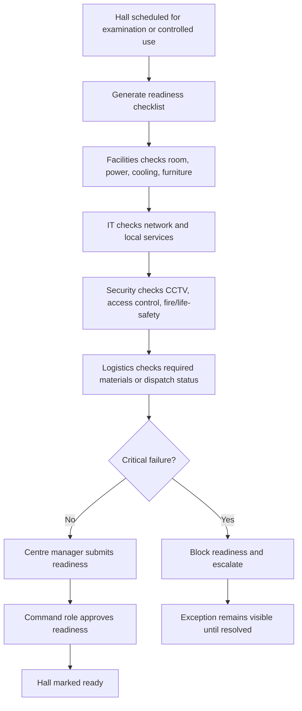

## 12. Domain Model Overview

### 12.1 Shared Kernel

Common value objects and rules:

- `EntityId`
- `SiteCode`
- `LocationId`
- `UserId`
- `Severity`
- `WorkflowStatus`
- `EvidenceReference`
- `AuditActor`
- `DateTimeRange`
- `ApprovalDecision`

### 12.2 SFL.IFIMP Aggregates

| Aggregate | Purpose |
|---|---|
| Facility | Site, building, floor, room, hall, zone, readiness attributes |
| WorkOrder | Fault, maintenance task, SLA, assignment, evidence, closure |
| PreventiveMaintenancePlan | Schedule, checklist, asset/room, next due date |
| RoomBooking | Booking request, conflict checks, approval, setup tasks |
| ReadinessChecklist | Hall/room readiness items and pass/fail evidence |

### 12.3 SFL.SSEMP Aggregates

| Aggregate | Purpose |
|---|---|
| VisitorVisit | Visitor, host, badge, access zone, check-in/out |
| AccessEvent | Door/reader event, grant/deny/override, zone, actor |
| CctvCamera | Camera profile, VMS/NVR reference, location, health |
| EvidenceRequest | Footage/photo/log request, approval, export reference, hash |
| SecurityIncident | Incident, severity, evidence, response, CAPA, closure |
| AlarmEvent | Intrusion/fire/panic/smoke event, acknowledgement, escalation |
| EmergencyNotification | Message, zones, channels, approval, delivery, acknowledgement |

### 12.4 SFL.FTLMP Aggregates

| Aggregate | Purpose |
|---|---|
| Vehicle | Vehicle profile, compliance, service status, readiness |
| DriverLogbook | Driver assignment, odometer, trip notes, closure |
| FuelRecord | Fuel issue, receipt, odometer, variance, reconciliation |
| DispatchManifest | Items, seals, route, recipient, status, evidence |
| CourierMovement | Mailroom/courier item movement and receipt |

### 12.5 SFL.AVAMP-Lite Aggregates

| Aggregate | Purpose |
|---|---|
| AssetReference | Basic asset/device identity and lifecycle reference |
| DeviceReference | Camera, reader, sensor, vehicle tracker, fire panel, NVR |
| LocationCustody | Current location or operational custody reference |

## 13. Events and Integration Contracts

Use domain events to keep modules decoupled.

### 13.1 Example Domain Events

| Event | Published By | Consumers |
|---|---|---|
| `FacilityFaultReported` | SFL.IFIMP | Workflow, reporting, notifications |
| `WorkOrderClosed` | SFL.IFIMP | Audit, reporting, readiness scoring |
| `RoomBookingApproved` | SFL.IFIMP | Workflow, notifications, security/logistics tasks |
| `VisitorCheckedIn` | SFL.SSEMP | SOC dashboard, evacuation roll-call |
| `AccessDeniedRecorded` | SFL.SSEMP | SOC dashboard, incident rules, audit |
| `CameraOfflineDetected` | SFL.SSEMP | SOC dashboard, IFIMP work order rule |
| `EvidenceExportApproved` | SFL.SSEMP | Audit, evidence store, investigation workflow |
| `AlarmRaised` | SFL.SSEMP | Incident workflow, notifications, SOC dashboard |
| `EmergencyNotificationSent` | SFL.SSEMP | Audit, reporting |
| `FuelAnomalyDetected` | SFL.FTLMP | Workflow, reporting, audit |
| `DispatchManifestIssued` | SFL.FTLMP | Logistics dashboard, audit |
| `DispatchReceiptConfirmed` | SFL.FTLMP | Audit, reporting |
| `HallReadinessBlocked` | SFL.Workflow | Executive dashboard, notifications |

### 13.2 External Integration Events

External systems should exchange stable integration events through Kafka where asynchronous communication is better than synchronous API calls.

| Event | Direction | Purpose |
|---|---|---|
| `StaffProfileChanged` | HRMS to SFL | Update staff status, reporting line, unit and access provisioning basis |
| `StaffOffboardingStarted` | HRMS to SFL | Trigger access deactivation, asset return and facility/custody checks |
| `ExamSchedulePublished` | Examination system to SFL | Create hall readiness windows and logistics preparation tasks |
| `HallReadinessConfirmed` | SFL to examination system | Confirm operational readiness for scheduled use |
| `HallReadinessBlocked` | SFL to examination system / command dashboard | Notify that a critical readiness issue prevents use |
| `CandidateAccommodationUpdated` | Student/exam records to SFL | Update controlled readiness and support requirements |
| `DispatchManifestIssued` | SFL to examination/logistics stakeholders | Publish dispatch readiness and tracking reference |
| `FuelExceptionApproved` | SFL to finance/audit | Support reconciliation and exception reporting |
| `EvidenceRecordArchived` | SFL to document/records system | Preserve approved evidence metadata and archive reference |
| `SecurityIncidentEscalated` | SFL to SIEM/SOC/NOC | Support security command and technical response |

External event rules:

- Use versioned event contracts.
- Include correlation ID, causation ID, event ID and timestamp.
- Keep payloads minimal and purpose-specific.
- Do not publish sensitive evidence content in Kafka messages; publish references and metadata.
- Use schema validation before publishing or consuming events.
- Use dead-letter topics for messages that cannot be processed.

### 13.3 Outbox Pattern With Kafka

Every transaction that changes business state and publishes an event should use an outbox table.

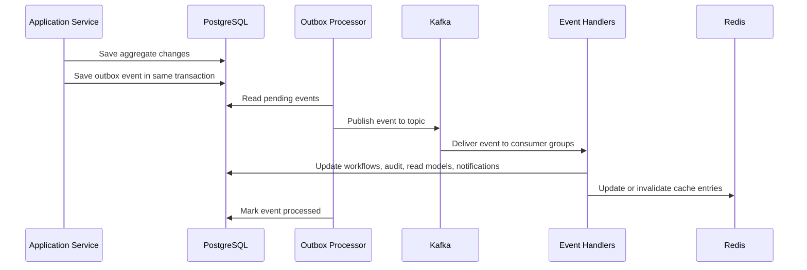

## 14. API Design

Use REST APIs for standard portal operations, controlled enterprise integrations and webhook endpoints for vendor/device events. Use Kafka where the integration is event-driven, high-volume, asynchronous or needs replay/retry behavior.

### 14.1 API Groups

| API Group | Example Route |
|---|---|
| Identity | `/api/identity/users`, `/api/identity/roles` |
| Workflow | `/api/workflows`, `/api/tasks`, `/api/approvals` |
| Evidence | `/api/evidence/requests`, `/api/evidence/items` |
| Facilities | `/api/ifimp/facilities`, `/api/ifimp/work-orders`, `/api/ifimp/bookings` |
| Safety/Security | `/api/ssemp/visitors`, `/api/ssemp/incidents`, `/api/ssemp/cctv`, `/api/ssemp/access-events` |
| Logistics | `/api/ftlmp/vehicles`, `/api/ftlmp/fuel-records`, `/api/ftlmp/dispatches` |
| Integration | `/api/integrations/webhooks/{vendor}`, `/api/integrations/messages` |
| Enterprise Integrations | `/api/integrations/external/{systemCode}`, `/api/integrations/contracts` |
| Reporting | `/api/reporting/dashboards/{dashboardCode}` |

### 14.2 API Rules

- Use versioned APIs, for example `/api/v1/...`.
- Validate Keycloak-issued JWT access tokens on protected API routes.
- Map Keycloak role/group claims to SFL permissions before executing commands.
- Use correlation IDs on all requests.
- Use explicit external system codes for enterprise integrations.
- Document API contracts with OpenAPI.
- Use idempotency keys for vendor webhooks and retry-sensitive commands. Short-lived idempotency state may be cached in Redis, but the original integration message should still be persisted.
- Validate role, location, and workflow authority before command execution.
- Never expose raw sensitive records without role-scoped filters.
- Do not allow direct evidence export without an approved workflow.
- Do not use Redis as the only enforcement point for authorization. Redis can accelerate permission lookup, but PostgreSQL and the identity source remain authoritative.
- Do not treat Keycloak roles as a substitute for workflow-specific authorization. Keycloak gives role claims; SFL.Workflow still checks site, case, approval, evidence, and escalation rules.
- Do not publish Kafka messages directly from controllers before transactional state is saved. Use the outbox publisher.
- Do not expose internal domain entities directly as external API models. Use request/response contracts and anti-corruption mapping.

## 15. Portal and User Experience

The Phase 1 portal should be role-based. A user should see only the platform, dashboard, tasks, and records relevant to their role.

### 15.1 Core Portal Areas

| Area | Users |
|---|---|
| Executive dashboard | Executive management, directors |
| Facilities dashboard | Facilities director, maintenance supervisor, technicians |
| SOC/security dashboard | Security director, SOC operator, visitor desk, emergency coordinator |
| Logistics dashboard | Head of logistics, fleet officer, dispatch controller, driver |
| Workflow inbox | All operational users |
| Evidence register | Security, audit, approved investigators, managers |
| Integration health | DTI, infrastructure, cybersecurity, integration engineer |
| Administration | Platform administrators |

### 15.2 Mobile Field Workflows

Mobile support should be provided for:

- Technicians completing work orders.
- Security officers responding to incidents.
- Visitor desk check-in/check-out.
- Drivers submitting logbooks.
- Dispatch officers confirming receipt.
- Future RFID/barcode scanning.

Mobile actions should support offline capture where operationally necessary, with controlled synchronization and conflict handling.

## 16. Security, Audit, and Evidence Governance

### 16.1 Security Requirements

- Use Keycloak as the identity provider.
- Use OpenID Connect/OAuth2 for portal and API authentication.
- Validate JWT issuer, audience, signature, expiry, and required claims.
- Enforce MFA for privileged users.
- Enforce RBAC for every command and query.
- Apply location scoping for centre/site-level roles.
- Encrypt traffic between portal, API, database, and integrations.
- Use service accounts for vendor integrations.
- Use Keycloak service accounts for system-to-system access where applicable.
- Rotate secrets and API keys.
- Log all privileged access and administrative actions.
- Forward security-relevant logs to SIEM where available.

### 16.2 Evidence Rules

- Evidence records must be immutable after formal submission.
- Evidence may be superseded only by a new evidence item, not overwritten.
- CCTV evidence export must require approval.
- Every evidence view/export must be logged.
- Evidence must preserve actor, timestamp, source, hash, and case reference.
- Deletion should be prohibited except through approved retention/legal process.

## 17. Dashboards

### 17.1 Phase 1 Dashboards

| Dashboard | Core Widgets |
|---|---|
| Executive SFL Dashboard | Overall readiness, critical incidents, SLA breaches, dispatch exceptions, emergency status |
| IFIMP Facilities Dashboard | Open work orders, critical faults, room readiness, preventive maintenance due, SLA ageing |
| SSEMP Security Command Dashboard | CCTV health, access denials, visitor status, active incidents, fire/intrusion alarms |
| FTLMP Logistics Dashboard | Vehicle availability, fuel exceptions, dispatch manifests, courier movements |
| Exam Command Readiness Dashboard | Hall readiness, CCTV/access/fire status, unresolved exceptions, dispatch readiness |
| Integration Health Dashboard | Device feeds, failed messages, retry queue, vendor health, API status |

### 17.2 Dashboard Data Rule

Dashboards should read from reporting/read-model tables, not from raw transactional tables where possible. This keeps dashboards fast and prevents reporting queries from interfering with operational workflows.

## 18. Testing and Acceptance

### 18.1 Test Levels

| Test Type | Purpose |
|---|---|
| Unit tests | Domain rules, value objects, validators, domain services and application handlers without external infrastructure |
| Integration tests | PostgreSQL, Redis, Kafka, Keycloak test realm, outbox, repositories and external adapters using controlled test containers or test doubles |
| API tests | HTTP endpoints, authentication, authorization, validation, status codes, request/response contracts and error formats |
| Solution tests | Full business scenarios crossing modules, workflow, database, Redis, Kafka and API boundaries in a Dockerized test stack |
| Architecture tests | Clean Architecture dependency rules, module boundaries, forbidden references and naming conventions |
| Workflow tests | End-to-end process execution and approval paths |
| Security tests | RBAC, MFA, evidence access, privileged actions |
| Keycloak identity tests | OIDC login, JWT validation, role/group mapping, MFA, service account authentication |
| Device simulation tests | CCTV/access/fire/alarm webhook processing |
| Redis cache tests | Cache hit/miss behavior, TTL expiry, invalidation after Kafka events |
| Kafka messaging tests | Producer/consumer flow, topic contracts, retry, dead-letter handling, idempotent consumption |
| Contract tests | External API and Kafka event contracts with wider enterprise systems and vendors |
| UAT | Operational owner validation |
| Commissioning tests | Infrastructure, devices, dashboards, audit evidence |

### 18.2 Recommended Test Project Structure

```text
tests/
  SFL.UnitTests/
  SFL.IntegrationTests/
  SFL.ApiTests/
  SFL.SolutionTests/
  SFL.ArchitectureTests/
  SFL.EndToEndTests/
```

### 18.3 Test Design Rules

- Unit tests must not require PostgreSQL, Redis, Kafka, Keycloak, Docker or vendor services.
- Integration tests may use Dockerized dependencies or approved test doubles.
- API tests should verify Keycloak token handling, role/group mapping and SFL workflow authorization.
- Solution tests should run complete scenarios such as facility fault, CCTV incident, dispatch, fuel anomaly and hall readiness.
- Architecture tests should fail the build if domain projects reference infrastructure projects.
- Contract tests should protect integration compatibility with external CLET systems and vendor platforms.
- CI should run fast unit and architecture tests on every commit.
- CI should run integration, API and solution tests before merge to release branches.
- Staging should run commissioning and UAT scripts before go-live.

### 18.4 Phase 1 Commissioning Test Scripts

| Test | Procedure | Pass Condition |
|---|---|---|
| CT-01 Facility Fault | Report fault, assign work order, upload evidence, close | Dashboard and audit trail update correctly |
| CT-02 Room Booking | Book room, detect conflict, approve, create setup task | Booking and setup workflow complete |
| CT-03 Visitor Check-In | Register visitor, approve, issue badge, check out | Visitor log and roll-call state update |
| CT-04 Access Event | Ingest access granted, denied, forced-door, override | Events appear in SOC dashboard and audit |
| CT-05 CCTV Evidence | Request footage, approve export, attach evidence reference | Export cannot occur without approval |
| CT-06 Alarm Event | Simulate intrusion/fire alert | Incident workflow and notification option trigger |
| CT-07 HSE Incident | Report near-miss, assign CAPA, close with evidence | Case cannot close without evidence |
| CT-08 Fuel Exception | Enter fuel record outside threshold | Exception routes to transport manager |
| CT-09 Dispatch | Create manifest, dispatch item, confirm receipt | Chain-of-custody is preserved |
| CT-10 Emergency Notification | Send zone-based alert and track delivery | Delivery and acknowledgement evidence retained |
| CT-11 Hall Readiness | Run readiness checklist with one failed critical item | Hall is blocked until resolved or approved exception exists |
| CT-12 Redis Cache Invalidation | Update room/device/workflow data and publish related Kafka event | Redis cache updates or invalidates within approved interval |
| CT-13 Kafka Dead-Letter Handling | Submit malformed or failing integration message | Message is retried, dead-lettered, visible to support, and original payload is preserved |
| CT-14 Keycloak Authorization | Sign in as users with different Keycloak roles/groups and attempt role-scoped workflows | Authentication succeeds, unauthorized commands fail, SFL permission mappings enforce site/workflow scope |
| CT-15 Dockerized Deployment | Build images and start API, web, worker, Keycloak, PostgreSQL, Redis and Kafka using the deployment stack | Containers start healthy, migrations apply, health checks pass and logs are visible |
| CT-16 External Contract Compatibility | Run sample API/Kafka contract tests against external-system simulators | Contracts validate, invalid payloads are rejected and compatible payloads create expected workflows/events |

## 19. Delivery Team

| Role | Responsibility |
|---|---|
| Solution Architect / Technical Lead | Owns architecture, module boundaries, integration model, security alignment |
| Backend Developers | Build .NET APIs, domain modules, workflows, integrations |
| Frontend Developer | Build web portal dashboards and operational screens |
| Mobile Developer | Build field workflows and offline capture where needed |
| Integration Engineer | Build CCTV/access/alarm/fire/fuel/vendor adapters and Kafka integration contracts |
| Database Engineer | PostgreSQL schemas, migrations, performance, backup model, cache/data consistency review |
| DevOps Engineer | CI/CD, environments, monitoring, deployment, rollback, Redis and Kafka operations |
| Cybersecurity Engineer | RBAC, MFA, logging, SIEM, threat model, security testing |
| QA Engineers | Test automation, UAT support, commissioning scripts |
| UI/UX Designer | Role-based dashboard and workflow design |
| Technical Writer / Trainer | SOPs, user guides, training packs, release notes |
| Operational Product Owners | Facilities, security, logistics, audit, executive dashboard validation |

## 20. Implementation Checklist

### 20.1 Before Development

- Confirm Phase 1 scope and owners.
- Approve platform naming: SFL.IFIMP, SFL.SSEMP, SFL.FTLMP, SFL.AVAMP.
- Approve Clean Architecture and SOLID implementation rules.
- Confirm hosting model and data residency.
- Confirm Docker deployment model, container registry, image naming, environment configuration and secrets management.
- Confirm Keycloak deployment model, realm name, clients, groups, roles, MFA policy, service accounts, and token lifetimes.
- Confirm external CLET system owners, API/event contracts, data ownership and fallback procedures.
- Confirm CCTV/VMS procurement integration requirement.
- Confirm access-control vendor/API requirement.
- Confirm fire/intrusion monitoring integration approach.
- Confirm SMS/email/voice/siren/signage providers.
- Confirm PostgreSQL deployment and backup standard.
- Confirm Redis deployment, clustering/high availability, key naming, TTL, and eviction policy.
- Confirm Kafka deployment, topic naming, partitioning, retention, consumer groups, retry, and dead-letter policy.
- Confirm audit and evidence retention policies.

### 20.2 During Development

- Build foundation first.
- Integrate Keycloak authentication before building protected operational workflows.
- Enforce Clean Architecture dependencies with architecture tests.
- Keep SOLID principles visible in code review.
- Keep modules decoupled.
- Enforce RBAC in every command/query.
- Map Keycloak groups/roles to SFL permissions and workflow rules.
- Use outbox for business events.
- Publish asynchronous events through Kafka.
- Use Redis only for approved cache/latest-state/idempotency scenarios.
- Store vendor payloads before processing.
- Capture audit events for all state changes.
- Require evidence for critical workflow closure.
- Build dashboards from reporting read models.
- Invalidate or refresh Redis after relevant Kafka events.
- Monitor Kafka lag, failed consumers, and dead-letter topics.
- Test vendor integrations with simulators before real devices arrive.
- Keep Docker Compose dev/test stacks working as the system evolves.
- Add or update unit, integration, API, solution and architecture tests with every feature.

### 20.3 Before Go-Live

- Complete workflow UAT.
- Complete Docker image build and deployment health checks.
- Complete Keycloak login, MFA, role/group mapping, and service-account tests.
- Complete RBAC and privileged-access tests.
- Complete CCTV evidence export test.
- Complete access-control event test.
- Complete alarm/fire event test.
- Complete fuel exception test.
- Complete dispatch chain-of-custody test.
- Complete emergency notification drill.
- Complete hall readiness simulation.
- Complete Redis cache invalidation test.
- Complete Kafka retry/dead-letter test.
- Complete API, integration, solution and external contract tests.
- Resolve or formally accept open risks.
- Obtain operational owner sign-off.

## 21. Naming Standards

Use SFL naming consistently across code, database, queues, documentation, and deployment.

### 21.1 Approved Names

| Type | Naming Pattern | Example |
|---|---|---|
| .NET namespace | `SFL.{Module}` | `SFL.SSEMP` |
| API route | `/api/v1/{platform}` | `/api/v1/ssemp/incidents` |
| Database schema | lowercase platform name | `ssemp.incidents` |
| Kafka topic | `sfl.{module}.{event-name}.v{version}` | `sfl.ssemp.camera-offline-detected.v1` |
| Kafka consumer group | `sfl.{capability}` | `sfl.workflow` |
| Redis key | `sfl:{module}:{purpose}:{scope}:{id}` | `sfl:ssemp:device-state:camera:CAM-001` |
| Service account | `svc-sfl-{integration}` | `svc-sfl-vms-adapter` |
| Docker image | `sfl-{component}` | `sfl-api`, `sfl-worker-service` |
| Container name | `sfl-{environment}-{component}` | `sfl-dev-api` |
| Environment variable | `SFL__{SECTION}__{SETTING}` | `SFL__KAFKA__BOOTSTRAP_SERVERS` |
| External system code | uppercase stable code | `HRMS`, `EXAMS`, `FINANCE`, `SIEM` |
| Dashboard code | `{PLATFORM}_{DASHBOARD}` | `SSEMP_SOC_COMMAND` |

### 21.2 Technical Module Names

| Module | Name |
|---|---|
| Facilities platform | `SFL.IFIMP` |
| Safety/security/emergency platform | `SFL.SSEMP` |
| Fleet/transport/logistics platform | `SFL.FTLMP` |
| Asset visibility platform | `SFL.AVAMP` |
| Identity and access | `SFL.IdentityAccess` |
| Workflow | `SFL.Workflow` |
| Audit and evidence | `SFL.AuditEvidence` |
| Integration hub | `SFL.IntegrationHub` |
| Notifications | `SFL.Notifications` |
| Reporting | `SFL.Reporting` |
| Distributed cache | `SFL.Caching` |
| Messaging/event streaming | `SFL.Messaging` |

## 22. Future Phase Extension

Phase 2 and Phase 3 should extend the same architecture. They should not introduce disconnected systems.

### Phase 2 Examples

- BMS/IoT integration.
- GPS/telematics.
- RFID/barcode asset management.
- Permit-to-work.
- Risk assessment library.
- Cleaning and janitorial workflows.
- Construction project management.
- Crisis and evacuation drill management.

### Phase 3 Examples

- Pest-control and hygiene audit tracker.
- Catering and cafeteria management.
- Lease and tenancy management.
- Waste and recycling tracking.
- Lost-and-found register.
- Predictive analytics and optimization reporting.

## 23. Practical Build Tutorial

This section gives the implementation team a recommended build sequence. The exact sprint structure can change, but the dependency order should remain stable.

### 23.1 Step 1: Create the Solution and Foundation

1. Create `SFL.sln`.
2. Add the core projects: `SFL.Api`, `SFL.WebPortal`, `SFL.WorkerService`, `SFL.SharedKernel`, `SFL.Infrastructure`.
3. Add shared services: `SFL.IdentityAccess`, `SFL.Workflow`, `SFL.AuditEvidence`, `SFL.Notifications`, `SFL.IntegrationHub`, `SFL.Reporting`, `SFL.Caching`, `SFL.Messaging`.
4. Add domain platforms: `SFL.IFIMP`, `SFL.SSEMP`, `SFL.FTLMP`, `SFL.AVAMP`.
5. Add test projects: `SFL.UnitTests`, `SFL.IntegrationTests`, `SFL.ApiTests`, `SFL.SolutionTests`, `SFL.ArchitectureTests`, `SFL.EndToEndTests`.
6. Add Dockerfiles for API, worker and web portal.
7. Add Docker Compose dev/test stacks.
8. Configure Keycloak realm, clients, groups, roles, MFA policy, service accounts, and token validation settings.
9. Configure PostgreSQL with schemas per platform.
10. Configure Redis with key naming, TTL policies, health checks, and cache abstraction.
11. Configure Kafka with baseline topics, consumer groups, retry policy, and dead-letter topics.
12. Configure structured logging, correlation IDs, health checks, and environment settings.
13. Create the first migration and seed role mappings, permissions, sites, and sample locations.

Deliverable: running application shell with Keycloak login, role-based navigation, empty dashboards, database migrations, Redis health, Kafka health, and platform health checks.

### 23.2 Step 2: Define External Enterprise Contracts

1. List all external CLET systems that SFL will communicate with.
2. Assign an owner and technical contact for each external system.
3. Define direction: inbound, outbound or bidirectional.
4. Define API contract, Kafka event contract or controlled file fallback.
5. Define data ownership and conflict-resolution rules.
6. Build adapter interfaces in `SFL.IntegrationHub`.
7. Build test simulators for unavailable external systems.
8. Add contract tests for each external integration.

Deliverable: external integration catalogue with versioned contracts, owners, test simulators and fallback procedures.

### 23.3 Step 3: Build the Shared Workflow Pattern

1. Implement workflow definitions.
2. Implement workflow instances.
3. Implement tasks, approvals, SLA timers, escalation rules, and closure evidence.
4. Implement the workflow inbox.
5. Implement audit event capture for every workflow action.
6. Implement notification hooks for assignment, approval, escalation, and closure.
7. Publish workflow events through the outbox to Kafka.
8. Cache workflow inbox counts and dashboard summaries in Redis.

Deliverable: one sample workflow can move from request to validation, assignment, evidence capture, approval, closure, audit, and dashboard update.

### 23.4 Step 4: Build the First Domain Workflow End-to-End

Start with facility fault to work order because it proves the core operating pattern.

1. Add IFIMP facility and room register.
2. Add work request command.
3. Add work order aggregate.
4. Add assignment and SLA logic.
5. Add evidence upload/reference.
6. Add supervisor validation.
7. Add dashboard read model.
8. Add audit trail.

Deliverable: operational users can report a facility fault, assign it, close it with evidence, and see dashboard updates.

### 23.5 Step 5: Add Safety/Security Device Ingestion

Build device ingestion with simulators first, then connect real vendors.

1. Create integration adapter base classes.
2. Create raw message storage.
3. Create idempotency handling.
4. Create event classification.
5. Create test adapters for CCTV, access control, intrusion alarm, and fire/life-safety.
6. Publish normalized device events to Kafka.
7. Cache latest device state in Redis for fast SOC dashboards.
8. Route simulated events into the SOC queue.
9. Create incident workflows from selected events.
10. Connect real vendor APIs after simulations pass.

Deliverable: simulated and real device events can create validated, audited operational workflows.

### 23.6 Step 6: Build Evidence Governance

1. Add evidence request workflow.
2. Add approval roles.
3. Add evidence metadata records.
4. Add evidence item references and hashes.
5. Add access logs for viewing/export.
6. Add retention policy fields.
7. Add CCTV/VMS export reference handling.

Deliverable: footage and sensitive evidence cannot be exported or attached to cases without approval and audit trail.

### 23.7 Step 7: Build Logistics and Dispatch

1. Add vehicle register.
2. Add driver records and driver logbooks.
3. Add fuel records and variance rules.
4. Add dispatch manifest.
5. Add seal/receipt/signature evidence.
6. Add courier movement tracking.
7. Add logistics dashboard.

Deliverable: vehicles, fuel exceptions, courier items, and dispatch manifests can be tracked with chain-of-custody evidence.

### 23.8 Step 8: Build Readiness and Command Dashboards

1. Create readiness score rules.
2. Link facilities, CCTV, access-control, fire/life-safety, network, power, and logistics checks.
3. Add hall readiness checklist.
4. Block readiness where critical checks fail.
5. Add command dashboard read models.
6. Add executive dashboard summary.

Deliverable: management and command users can see readiness, blocked halls, unresolved incidents, and dispatch exceptions.

### 23.9 Step 9: Dockerize and Validate Deployment

1. Build Docker images for API, web portal and worker service.
2. Start the full local stack with Docker Compose.
3. Validate Keycloak, PostgreSQL, Redis and Kafka health checks.
4. Run database migrations inside the containerized environment.
5. Run unit, integration, API, solution and architecture tests.
6. Run sample external integration contract tests against simulators.
7. Confirm logs, metrics and health endpoints are available.
8. Document promotion from dev to staging to production.

Deliverable: repeatable Dockerized deployment package with passing tests and health checks.

### 23.10 Step 10: Commission the System

1. Run all workflow tests.
2. Run RBAC and evidence access tests.
3. Run device simulator tests.
4. Run real vendor integration tests.
5. Run emergency notification drill.
6. Run hall readiness simulation.
7. Run dispatch chain-of-custody simulation.
8. Run Dockerized deployment test.
9. Run external contract compatibility test.
10. Capture sign-off evidence.

Deliverable: Phase 1 go-live approval pack.

## 24. Definition of Done

A Phase 1 module is done only when all of the following are true:

- The business owner can complete the workflow without developer assistance.
- Code follows Clean Architecture boundaries and SOLID design rules.
- Keycloak authentication, role/group mapping, and SFL permission checks work for the target users.
- The workflow enforces role, location, approval, and evidence rules.
- Every state change creates an audit event.
- Required dashboards update after the workflow changes state.
- Redis cache entries are updated, invalidated, or deliberately not used according to the cache design.
- Kafka events are published and consumed successfully where the workflow requires asynchronous processing.
- Failed integration events are stored, retried, and visible.
- External API/event contracts are documented and tested where the module communicates outside SFL.
- Docker image builds successfully and runs in the approved deployment stack.
- Sensitive evidence is access-controlled.
- Unit, integration, API, solution and architecture tests pass.
- UAT test cases pass.
- Operational SOP is documented.
- Training material exists.
- Open risks are resolved or formally accepted.

## 25. Final Architecture Summary

The Phase 1 SFL system should be implemented as a DDD-based modular monolith in .NET Core using Clean Architecture and SOLID principles. It should be Dockerized from the beginning and designed to communicate with the wider CLET enterprise ecosystem through versioned APIs, Kafka events and controlled integration adapters.

It should use Keycloak for authentication, SSO, MFA, groups, role claims and service accounts; PostgreSQL for authoritative operational records; Redis for fast cache and latest-state snapshots; and Kafka for durable event streaming and asynchronous processing.

The correct build pattern is:

```text
DDD for domain boundaries.
Clean Architecture and SOLID for maintainable implementation.
Keycloak for authentication, SSO, MFA, service accounts, groups, and broad role claims.
Workflow engine for operational process control.
Event-driven integration for device alerts and module coordination.
Versioned APIs and Kafka contracts for wider CLET system communication.
PostgreSQL schemas for bounded-context ownership.
Redis for fast cache, latest-state snapshots, dashboard summaries, idempotency keys, and short-lived coordination.
Kafka for durable event streaming, async processing, device events, integration retries, notification fan-out, and dashboard updates.
Dockerized deployment for development, testing, staging and production parity.
Unit, integration, API, solution and architecture tests as mandatory quality gates.
Vendor adapters for CCTV, access control, alarm, fire/life-safety, fuel, and notifications.
Audit/evidence store for institutional accountability.
Role-based dashboards for operations and management.
```

The most important implementation rule is simple:

> Build one coordinated SFL operating platform, not 13 disconnected applications.
